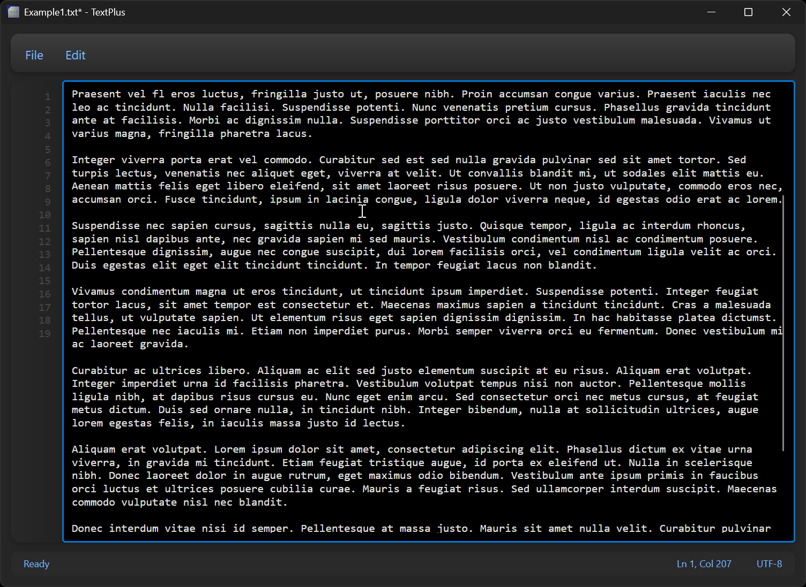
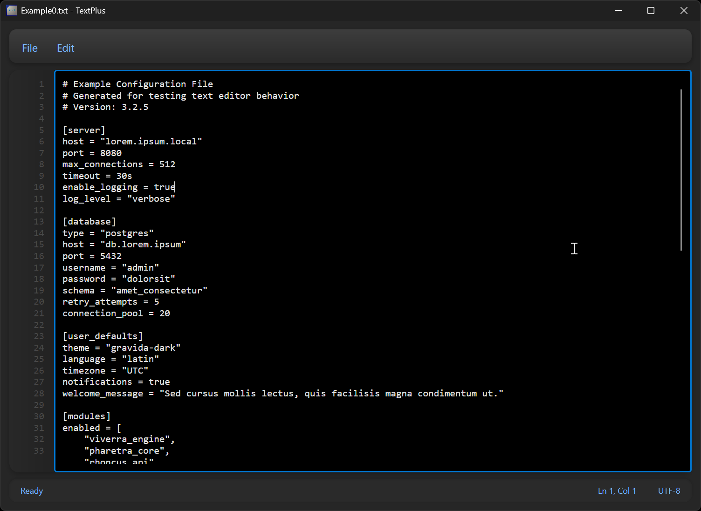

# TextPlus

A basic, but cool(ish) looking text editor.
You can basically use it in place of modern Notepad.

## Screenshots

## Features

- File operations (New, Open, Save, Save As)
- Edit operations (Undo, Redo, Cut, Copy, Paste, Select All)
- Keyboard shortcuts (Kindof works)
- Line numbers (Also kindof works ish)
- Neomorphic dark theme UI
- Status bar with line/column tracking
